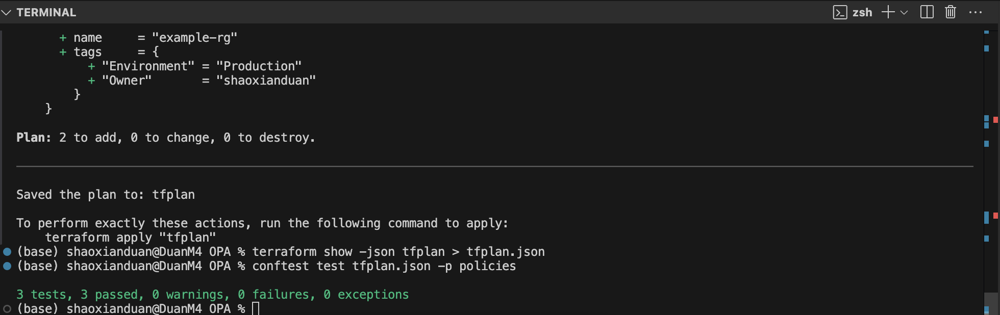
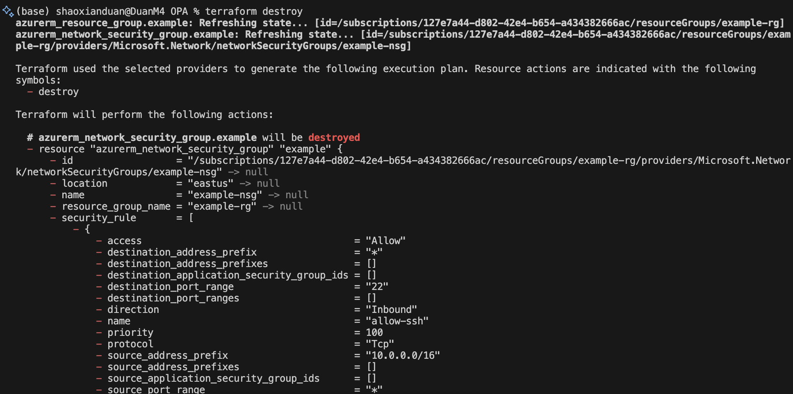
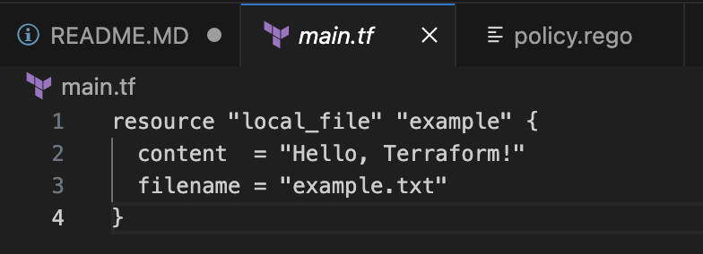
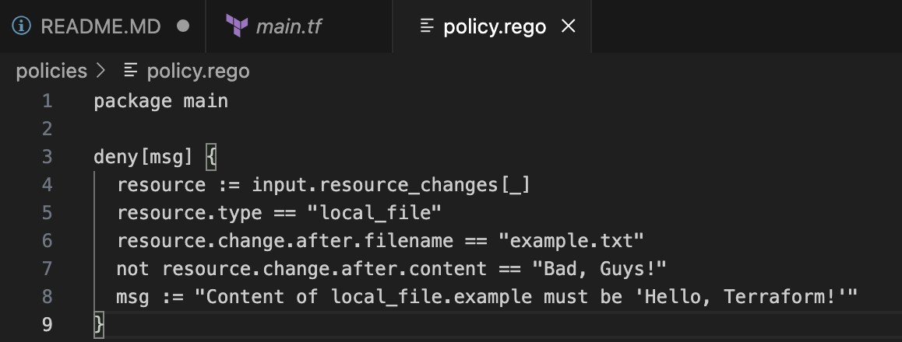

Terraform and Conftest CI/CD Pipeline
Project Overview
This project demonstrates a CI/CD pipeline using Terraform and Conftest to automate infrastructure code testing and validation. It includes instructions for installing Terraform and Conftest on macOS and WSL, generating Terraform plans, testing policies with Conftest, and integrating with GitHub Actions for automation.
Prerequisites

Operating System: macOS (Apple Silicon) or WSL (Ubuntu)
Tools: Git, curl, unzip, tar
GitHub Account: Required for creating a repository and running GitHub Actions

Installation Steps
1. Install Terraform
macOS
cd /tmp
curl -O https://releases.hashicorp.com/terraform/1.6.6/terraform_1.6.6_darwin_arm64.zip
unzip terraform_1.6.6_darwin_arm64.zip
sudo mv terraform /usr/local/bin/
terraform -v

WSL (Ubuntu)
cd /tmp
curl -O https://releases.hashicorp.com/terraform/1.6.6/terraform_1.6.6_linux_amd64.zip
unzip terraform_1.6.6_linux_amd64.zip
sudo mv terraform /usr/local/bin/
terraform -v

2. Install Conftest
macOS
cd /tmp
curl -LO https://github.com/open-policy-agent/conftest/releases/download/v0.45.0/conftest_0.45.0_Darwin_arm64.tar.gz
tar -xzf conftest_0.45.0_Darwin_arm64.tar.gz
sudo mv conftest /usr/local/bin/
conftest --version

WSL (Ubuntu)
cd /tmp
curl -LO https://github.com/open-policy-agent/conftest/releases/download/v0.45.0/conftest_0.45.0_Linux_x86_64.tar.gz
tar -xzf conftest_0.45.0_Linux_x86_64.tar.gz
sudo mv conftest /usr/local/bin/
conftest --version

Usage Instructions
3.1 Initialize Terraform
terraform init

Initializes the Terraform working directory and downloads required provider plugins (e.g., hashicorp/local).

3.2 Generate and Save Plan
3.2.1 Create main.tf
resource "local_file" "example" {
  content  = "Hello, Terraform!"
  filename = "example.txt"
}

3.2.2 Reinitialize (if needed)
terraform init

3.2.3 Generate Terraform Plan
terraform plan -out=tfplan

3.2.4 Convert to JSON Format
terraform show -json tfplan > tfplan.json

4. Test Against Policies

4.1 Create Policies Directory
mkdir policies

4.2 Create Policy File
Add the following content to policies/policy.rego:
package main

deny[msg] {
  resource := input.resource_changes[_]
  resource.type == "local_file"
  resource.change.after.filename == "example.txt"
  not resource.change.after.content == "Hello, Terraform!"
  msg := "Content of local_file.example must be 'Hello, Terraform!'"
}

4.3 Run Conftest Test
conftest test tfplan.json -p policies

4.4 Interpret Output

Pass: If the content in main.tf is "Hello, Terraform!", the test passes:
PASS - tfplan.json
= 
This policy checks the local_file resource to ensure the example.txt file content is "Hello, Terraform!".

Fail: If the content doesn't match (e.g., "Hello, World!"), the test fails:
FAIL - tfplan.json - Content of local_file.example must be 'Hello, Terraform!'

Failure may also occur due to missing tags, insecure configurations, etc. (depending on additional policies).
=/=

5. GitHub Actions Integration
5.1 Create Workflow Directory
mkdir -p .github/workflows

5.2 Create Workflow File
Add the following content to .github/workflows/terraform-conftest.yml:
name: Terraform and Conftest CI

on:
  push:
    branches:
      - main
  pull_request:
    branches:
      - main

jobs:
  terraform-conftest:
    name: Terraform Plan and Conftest Test
    runs-on: ubuntu-latest

    steps:
      # Checkout the code
      - name: Checkout code
        uses: actions/checkout@v3

      # Install Terraform
      - name: Setup Terraform
        uses: hashicorp/setup-terraform@v2
        with:
          terraform_version: 1.6.6

      # Install Conftest
      - name: Install Conftest
        run: |
          curl -LO https://github.com/open-policy-agent/conftest/releases/download/v0.45.0/conftest_0.45.0_Linux_x86_64.tar.gz
          tar -xzf conftest_0.45.0_Linux_x86_64.tar.gz
          sudo mv conftest /usr/local/bin/
          conftest --version

      # Init Terraform
      - name: Terraform Init
        run: terraform init

      # Setup Terraform plan
      - name: Terraform Plan
        id: plan
        run: terraform plan -out=tfplan -no-color

      # Transform JSON format
      - name: Convert Terraform Plan to JSON
        run: terraform show -json tfplan > tfplan.json

      # Run Conftest tests
      - name: Conftest Test
        run: conftest test tfplan.json -p policies

5.3 Push Code to GitHub

Create a new repository on GitHub (e.g., boda0004/Applied_Project).
Initialize the local Git repository and push:git init
git add .
git commit -m "Initial commit with Terraform, Conftest, and GitHub Actions"
git remote add origin https://github.com/shaoxian423/8922Terraform.git
git push -u origin main

Visit your GitHub repository, go to the Actions tab, and check the workflow run.

Contributing
This file is derived from boda0004
Author
boda0004，duan007

