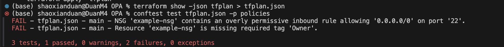
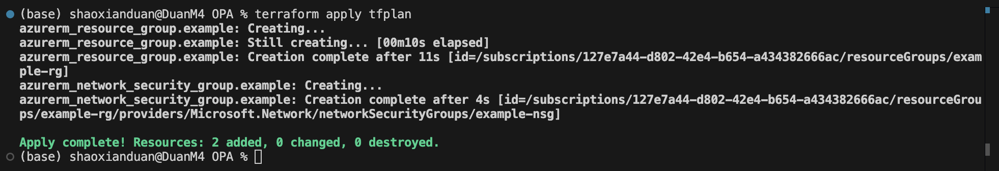
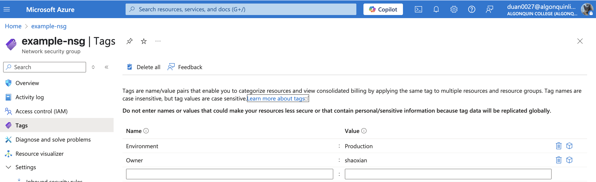
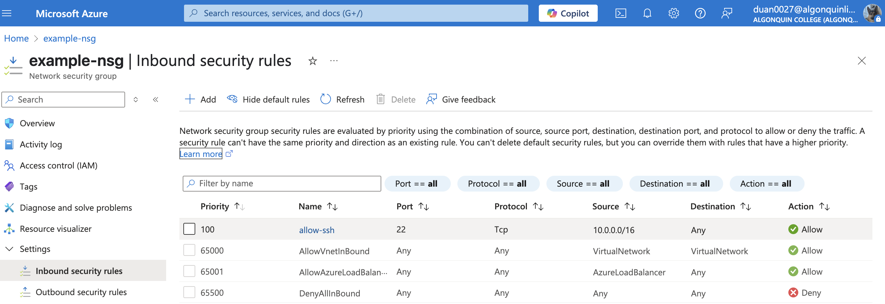
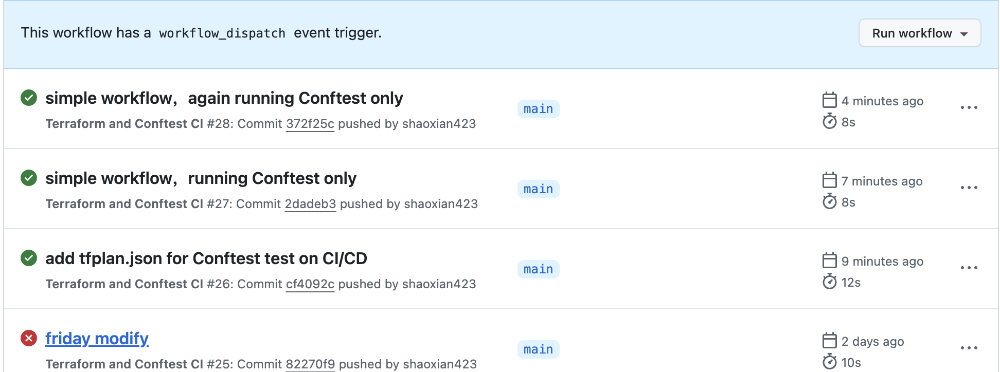
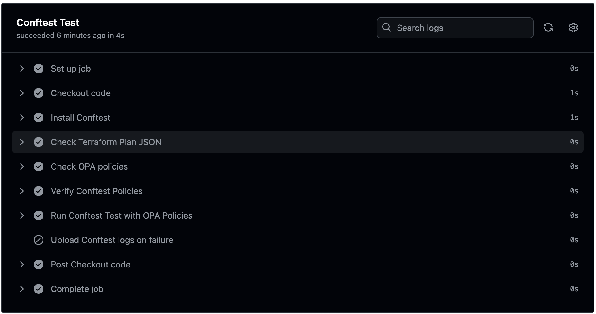
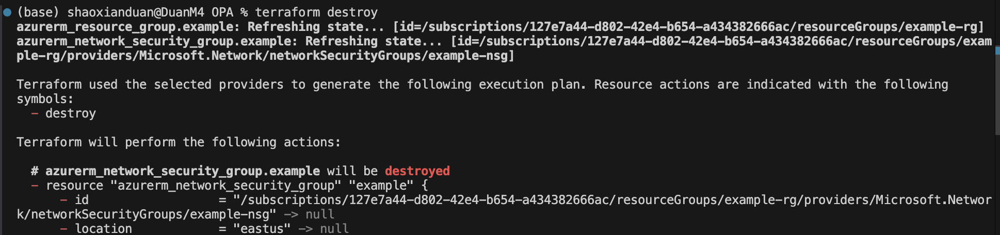
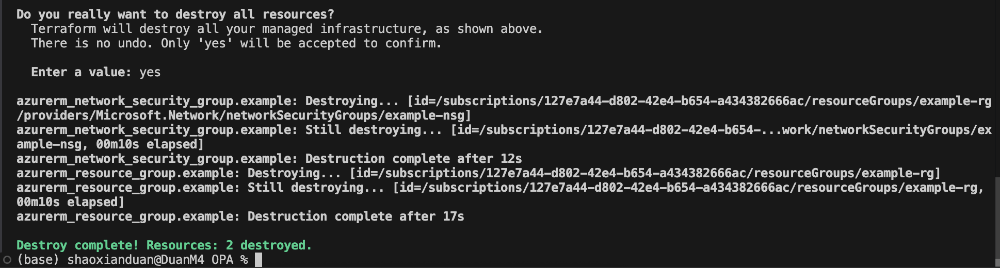

# Terraform and Conftest CI/CD Pipeline

## Project Overview

This project demonstrates a CI/CD pipeline using Terraform and Conftest to automate infrastructure code testing and validation. It provides step-by-step instructions for:

## Repository Structure

```bash
.
├── .github/                # GitHub Actions CI/CD pipeline
│   └── terraform-conftest.yml
├── terraform/              # Terraform configuration files
│   └── terraform.lock.hcl
├── policies/               # Rego policies for Conftest
│   └── policy.rego
├── main.tf                 # Main Terraform configuration file
├── .gitignore              # Files to ignore during Git operations
├── README.md               # Project documentation
├── tfplan.json             # Terraform plan in JSON format for Conftest testing
├── terraform.tfstate       # Terraform state file
├── terraform.tfstate.backup # Terraform state backup file
├── tfplan                  # Terraform plan file
└── (other files, e.g., images, documents)
```

## Getting Started

### Prerequisites

- Terraform
- Conftest
- GitHub CLI (if testing locally)
- Azure CLI (for Azure resources)

### Setup

GitHub Account: Required for creating a repository and running GitHub Actions workflows.

Installation Steps
# 1. Install Terraform
On macOS (Apple Silicon)
cd /tmp
curl -O https://releases.hashicorp.com/terraform/1.6.6/terraform_1.6.6_darwin_arm64.zip
unzip terraform_1.6.6_darwin_arm64.zip
sudo mv terraform /usr/local/bin/
terraform -v

On WSL (Ubuntu)
cd /tmp
curl -O https://releases.hashicorp.com/terraform/1.6.6/terraform_1.6.6_linux_amd64.zip
unzip terraform_1.6.6_linux_amd64.zip
sudo mv terraform /usr/local/bin/
terraform -v

Expected Output:

The terraform -v command should output Terraform v1.6.6.

# 2. Install Conftest
On macOS (Apple Silicon)
cd /tmp
curl -LO https://github.com/open-policy-agent/conftest/releases/download/v0.45.0/conftest_0.45.0_Darwin_arm64.tar.gz
tar -xzf conftest_0.45.0_Darwin_arm64.tar.gz
sudo mv Zconftest /usr/local/bin/
conftest --version

On WSL (Ubuntu)
cd /tmp
curl -LO https://github.com/open-policy-agent/conftest/releases/download/v0.45.0/conftest_0.45.0_Linux_x86_64.tar.gz
tar -xzf conftest_0.45.0_Linux_x86_64.tar.gz
sudo mv conftest /usr/local/bin/
conftest --version

Expected Output:

The conftest --version command should output Conftest: 0.45.0.

# 3 Usage Instructions
3.1 Initialize Terraform
terraform init


Purpose: Initializes the Terraform working directory and downloads required provider plugins (e.g., hashicorp/local).

3.2 Generate and Save Terraform Plan
3.2.1 Create main.tf
Create a file named main.tf with the following content:
terraform {
  required_providers {
    azurerm = {
      source  = "hashicorp/azurerm"
      version = "~> 3.0"
    }
  }
}

provider "azurerm" {
  features {}
  subscription_id = "127e7a44-d802-42e4-b654-a434382666ac" # Azure for Students 订阅 ID
}

resource "azurerm_resource_group" "example" {
  name     = "example-rg"
  location = "East US"
  tags = {
    Environment = "Production"
    Owner       = "shaoxianduan"
  }
}

resource "azurerm_network_security_group" "example" {
  name                = "example-nsg"
  location            = azurerm_resource_group.example.location
  resource_group_name = azurerm_resource_group.example.name

  security_rule {
    name                       = "allow-ssh"
    priority                   = 100
    direction                  = "Inbound"
    access                     = "Allow"
    protocol                   = "Tcp"
    source_port_range          = "*"
    destination_port_range     = "22"
    source_address_prefix      = "10.0.0.0/16" # Open rule, used to test policy failure
    destination_address_prefix = "*"
  }

  tags = {
    Environment = "Production"
    Owner       = "shaoxian"
  }
}

3.2.2 Reinitialize (if needed)
If you made changes to main.tf, reinitialize Terraform:
terraform init

3.2.3 Generate Terraform Plan
Generate a Terraform plan and save it as tfplan:
terraform plan -out=tfplan

3.2.4 Convert to JSON Format
Convert the Terraform plan to JSON format for Conftest testing:
terraform show -json tfplan > tfplan.json

# 4. Test Against Policies
4.1 Create Policies Directory
mkdir policies

4.2 Create Policy File
Create a policy file named policy.rego inside the policies directory with the following content:
package main

# Strategy 1: Prohibit overly permissive firewall rules
deny[msg] {
  resource := input.resource_changes[_]
  resource.type == "azurerm_network_security_group"
  rule := resource.change.after.security_rule[_]
  rule.direction == "Inbound"
  rule.source_address_prefix == "0.0.0.0/0"
  rule.destination_port_range != "443"
  msg := sprintf("NSG '%s' contains an overly permissive inbound rule allowing '0.0.0.0/0' on port '%s'.", [resource.change.after.name, rule.destination_port_range])
}

# Strategy 2: Enforce Environment tags
deny[msg] {
  resource := input.resource_changes[_]
  allowed_types := ["azurerm_resource_group", "azurerm_network_security_group"]
  resource.type == allowed_types[_]
  not resource.change.after.tags["Environment"]
  msg := sprintf("Resource '%s' is missing required tag 'Environment'.", [resource.change.after.name])
}

# Strategy 3: Enforce Owner tags
deny[msg] {
  resource := input.resource_changes[_]
  allowed_types := ["azurerm_resource_group", "azurerm_network_security_group"]
  resource.type == allowed_types[_]
  not resource.change.after.tags["Owner"]
  msg := sprintf("Resource '%s' is missing required tag 'Owner'.", [resource.change.after.name])
}


Fail:

If the content does not match (e.g., "miss owner or source_address_prefix changed"), the test fails:

FAIL - tfplan.json - main - NSG 'example-nsg' contains an overly permissive inbound rule allowing '0.0.0.0/0' on port '22'.
FAIL - tfplan.json - main - Resource 'example-nsg' is missing required tag 'Owner'.


# 5. Apply this plan to Azure
by running: terraform apply tfplan. Terraform will execute the operations based on the tfplan file, creating or updating Azure resources.


Check on Azure portal:
5.1 Tag


5.2 in Inbound security rules


### GitHub Actions Workflow

# 6. GitHub Actions Integration
6.1 Create Workflow Directory
mkdir -p .github/workflows

6.2 Create Workflow File
Create a file named terraform-conftest.yml inside the .github/workflows directory with the following content:
name: Terraform and Conftest CI

name: Terraform and Conftest CI

on:
  push:
    branches:
      - main
  pull_request:
    branches:
      - main
  workflow_dispatch:

jobs:
  terraform-conftest:
    name: Conftest Test
    runs-on: ubuntu-latest

    steps:
      # Checkout code
      - name: Checkout code
        uses: actions/checkout@v4

      # Install Conftest
      - name: Install Conftest
        run: |
          wget -q https://github.com/open-policy-agent/conftest/releases/download/v0.45.0/conftest_0.45.0_Linux_x86_64.tar.gz
          tar -xzf conftest_0.45.0_Linux_x86_64.tar.gz
          sudo mv conftest /usr/local/bin/
          conftest --version

      # Verify tfplan.json existence
      - name: Check Terraform Plan JSON
        run: |
          if [ ! -f "tfplan.json" ]; then
            echo "Error: tfplan.json not found"
            exit 1
          fi
          echo "Found Terraform plan JSON: tfplan.json"

      # Verify Conftest policies existence
      - name: Check OPA policies
        run: |
          if [ ! -d "policies" ] || [ -z "$(ls -A policies/*.rego 2>/dev/null)" ]; then
            echo "Error: No OPA policy files found in 'policies' directory"
            exit 1
          fi
          echo "Found OPA policies:"
          ls -l policies/*.rego

      # Verify Conftest policies
      - name: Verify Conftest Policies
        run: |
          conftest verify -p policies 2> conftest_verify_error.log
          if [ $? -ne 0 ]; then
            echo "Invalid OPA policies detected. Error details:"
            cat conftest_verify_error.log
            exit 1
          fi
          echo "OPA policies verified successfully"

      # Run Conftest test with OPA policies and detailed logs
      - name: Run Conftest Test with OPA Policies
        run: |
          conftest test tfplan.json -p policies --all-namespaces --trace > conftest_output.log 2> conftest_error.log
          TEST_STATUS=$?
          if [ $TEST_STATUS -ne 0 ]; then
            echo "Conftest policy enforcement failed. Violations found:"
            cat conftest_error.log
            echo "Detailed test output:"
            cat conftest_output.log
            exit 1
          fi
          echo "Conftest policy enforcement passed. No violations found."
          cat conftest_output.log

      # Upload Conftest logs on failure
      - name: Upload Conftest logs on failure
        if: failure()
        uses: actions/upload-artifact@v4
        with:
          name: conftest-logs
          path: |
            conftest_output.log
            conftest_error.log

6.3 Push Code to GitHub

Create a New Repository on GitHub:

Create a repository named 8922Terraform under your GitHub account (e.g., shaoxian423/8922Terraform).


Initialize Local Git Repository and Push:


git init
git add .
git commit -m "Initial commit with Terraform, Conftest, and GitHub Actions"
git remote add origin https://github.com/shaoxian423/8922Terraform.git
git push -u origin main

Verify Workflow:
Visit your GitHub repository (https://github.com/shaoxian423/8922Terraform).
Go to the Actions tab to check the workflow run.
The workflow should execute all steps and display a PASS result for the Conftest test if the policy is met.




# 7. Terraform Destory
running after : terraform destroy

type:yes


## Contributing
This project is derived from the work of boda0004. Contributions are welcome! Feel free to submit Pull Requests or Issues to improve the project.


## Authors
boda0004(github: boda0004)
duan007 (gitHub: shaoxian423)
elsa0105
fan00079

